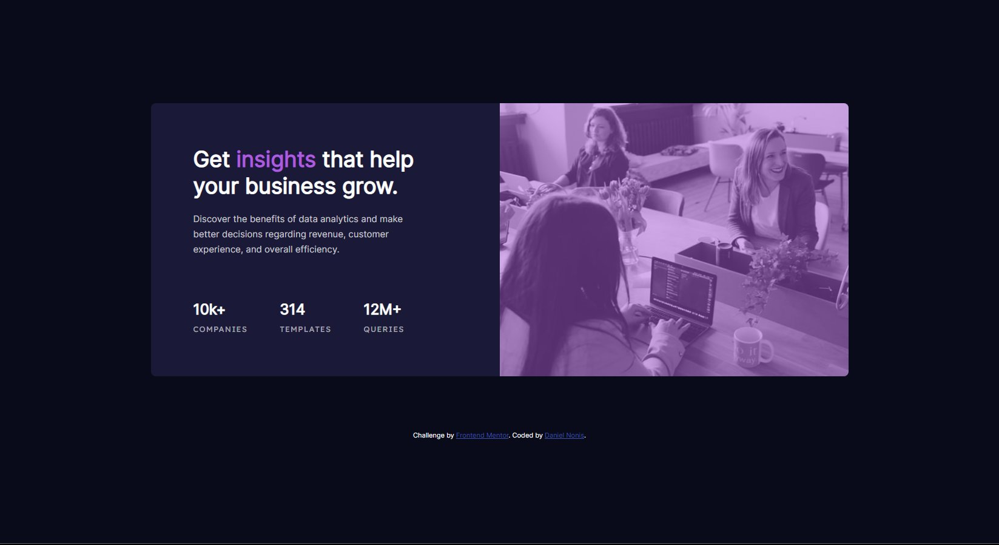

# Frontend Mentor - Stats preview card component solution

This is a solution to the [Stats preview card component challenge on Frontend Mentor](https://www.frontendmentor.io/challenges/stats-preview-card-component-8JqbgoU62). Frontend Mentor challenges help you improve your coding skills by building realistic projects. 

## Table of contents

- [Overview](#overview)
  - [The challenge](#the-challenge)
  - [Screenshot](#screenshot)
- [My process](#my-process)
  - [Built with](#built-with)
  - [Continued development](#continued-development)
- [Author](#author)

**Note: Delete this note and update the table of contents based on what sections you keep.**

## Overview

### The challenge

Users should be able to:

- View the optimal layout depending on their device's screen size

### Screenshot

## My process

I set the background color of the main page then made a '''<main>''' container divided into 2 '''
'''. Then, I gave the description panel a flex display property. It was a bit finicky to get as close to he design as possible with font size and other adjustments but I think I got it right enough. The next thing was the stats, which I also gave a flex display and a flex direction of ROW. 
For the image I tried a few different approaches, like an overlay or trying to tint it with a CSS property, but I just gave up and decided to make the background of the image panel the soft violet color provided in the style-guide file and reduced the opacity of the picture by 50%, which is why my solution's picture is less vibrant than the example.
The desing for mobile was a tad tricky, because I had to change the flex-direction to reverse-column, to have the image first. Following that I had to pretty much undo any properties that I added to the text in order to make it as close to the original in the desktop version. After that I once again changed the flex direction of the stats '''
'''.

### Built with

- Semantic HTML5 markup
- CSS custom properties
- Flexbox

### Continued development

I'd love to just learn more about standard practices and maybe get started with Tailwind or Bootsrap.

## Author

- Frontend Mentor - [@Xarxytarsan](https://www.frontendmentor.io/profile/Xarxytarsan)

